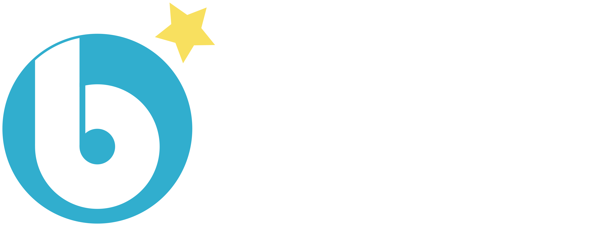
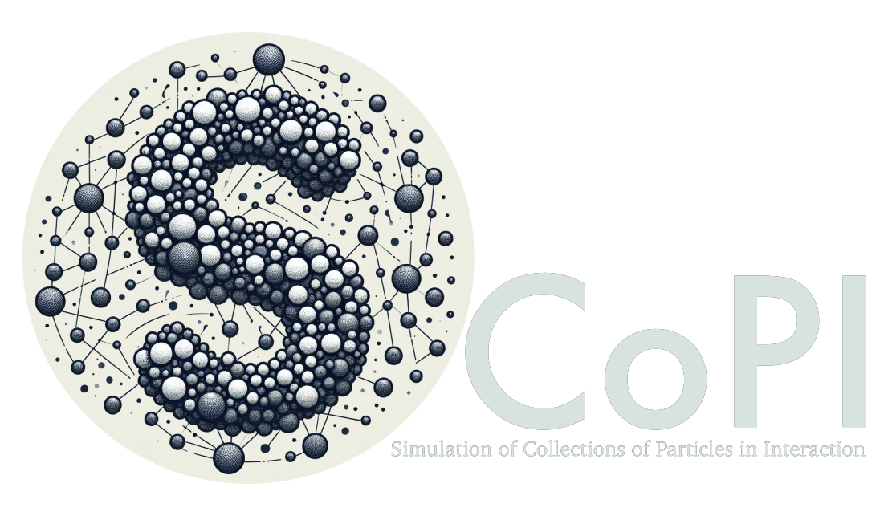

## Team composition

```{=html}
<link href="https://cdn.jsdelivr.net/npm/bootstrap@5.3.0/dist/css/bootstrap.min.css" rel="stylesheet">
<script src="https://cdn.jsdelivr.net/npm/bootstrap@5.3.0/dist/js/bootstrap.bundle.min.js"></script>
```

:::{.center-page}
- 5 researchers
- 6 research engineers in scientific computing
- 2 post-docs
- 8 phd students
- Several external collaborators (~10)
:::

# Scientific topics

## Computer assisted proof in PDEs

<br>

<br>

:::{.row}
::::{.col .align-self-center .text-center}
- Existence
of specific solutions (overall dynamics of the system - limit cycles / travelling waves...)
- Certification of the result of a numerical simulation
- Based on a fixed point argument
in the vicinity of the approximate solution
- Numerical analysis and computations
:::
:::

<br>

**emerging topics**

:::{.row}
::::{.col .align-self-center .text-center}
- Navier-Stokes
- Cost reduction of simulations
- Bifurcations
- Connexions in parabolic PDEs 
- Beyond Fourier Series standard tools
:::
:::


## Computational linear algebra


<br>

<br>

:::{.row}
::::{.col .align-self-center .text-center}
- Applied and computational linear algebra
- High-performance computing in the sense of
massively parallel computing,
- Domain decomposition,
- Preconditioning,
- Krylov solvers (Conjugate gradient,
GMRES, etc.),
- PDEs with stochastic coefficients
:::
:::

<br>

**applications**

:::{.row}
::::{.col .align-self-center .text-center}
- Solid Mechanics
- Development of code and libraries
:::
:::


## Kinetic theory and moment methods

<br>

<br>

:::{.row}
::::{.col .align-self-center .text-center}
- Derivation of fluid equation from kinetic theory
- Method of moments (Closure)
- Multi-scale Chapman Enskog and Hilbert expansion
- Limits of approach and link with SAP
- Geometric Method of Moments
- Large phase space description - semi-kinetic method
:::
:::

<br>

**applications**

:::{.row}
::::{.col .align-self-center .text-center}
- Two-phase flows
- Hybrid fluid-rarefied flows
- Plasma physics
- Countrail formation and pollution modelling 
- Nuclear Engineering
:::
:::

## New numerical schemes

<br>

<br>

:::{.row}
::::{.col .align-self-center .text-center}
- Dynamic spatial and temporal adaptation with error control (wavelet/splitting/ImEx)
- Code coupling - high-order multi-step 
- DG methods and high-order wavelets
- Well-balanced / AP schemes / time-space approach
:::
:::

<br>

**applications**

:::{.row}
::::{.col .align-self-center .text-center}
- Combustion
- Lithium Battery
- Plasma physics
- Two-phase flows 
- Biomedical Engineering
- Propulsion and reentry at high altitude
:::
:::

## Variational approch (SAP)

<br>

<br>

:::{.row}
::::{.col .align-self-center .text-center}
- Derivation of PDEs wihtout dissipation 
- Analysis of mathematical properties
- Link with KT / fluid approach from microscopic
- Lin constraint - Geometry
:::
:::

<br>

**applications**

:::{.row}
::::{.col .align-self-center .text-center}
- Plasma physics
- Two-phase flows 
- Fluid Mechanics
- Nuclear Engineering
:::
:::

## lattice Boltzmann methods

<br>

<br>

:::{.row}
::::{.col .align-self-center .text-center}
- Numerical Analysis of LB schemes 
- Treatment of boundary conditions 
- Dynamic mesh adaption with erroir control
- High order schemes 
- Hyperbolic/parabolic scaling 
:::
:::

<br>

**applications**

:::{.row}
::::{.col .align-self-center .text-center}
- Two-phase flows 
- Fluid Mechanics
- Aerospace Engineering - Hypersonic flows
:::
:::

## Turbulence, processes and particles

<br>

<br>

:::{.row}
::::{.col .align-self-center .text-center}
- Low-regularity stochastic processes (Intermittency)
- Kinetic Simulation of Turbulence based on wavelets
- Numerical simulation based on OU processes
- Kinetic approach / FP / Moment methods
- Link with SPDEs in fluid mechanics
:::
:::

<br>

**applications**

:::{.row}
::::{.col .align-self-center .text-center}
- Two-phase flows 
- Fluid Mechanics and Turbulence
- LES of two-way coupled particle-laden turbulence
:::
:::


## Emerging topics : Quantum computing

<br>

<br>

:::{.row}
::::{.col .align-self-center .text-center}
- Quantum algorithm for PDE simulation
- Mesh adaptation and error control 
- Linear Algebra
- FE programming with DOLFINx and PETSc (Python + MPI),
- Quantum computer emulation with
Qiskit (Python).
:::
:::

<br>

**applications**

:::{.row}
::::{.col .align-self-center .text-center}
- ElectroMagnetism : Maxwell Equations
:::
:::

## Emerging topics : SciML

<br>

<br>

:::{.row}
::::{.col .align-self-center .text-center}
- Simulation of high-dimensional PDEs 
- Closure for moment methods 
:::
:::

<br>

**applications**

:::{.row}
::::{.col .align-self-center .text-center}
- Plasma physics
- Two-phase flows 
- Financial Engineering (collab.)
:::
:::

# Technical skills

## open source software

**samurai**

:::{.row}
::::{.col}

- C++ 20 header only
- Adaptive mesh refinement techniques
- New data structure: intervals + algebra of sets
- Finite volume and lattice Boltzmann methods
- MPI and GPU soon
::::
::::{.col .align-self-center  .text-center}
{width="80%"}
::::
:::


<br>

**ponio**

:::{.row}
::::{.col}
- C++ 20 header only
- time integrators for solving differential equations
- A large collection of methods:
  eRK, DIRK, LRK, expRK, RKC, Lie or Strang splitting
- Highly flexible
::::
::::{.col .align-self-center .text-center}
{width="60%"}
::::
:::

## open source software

**pylbm**

:::{.row}
::::{.col}

- Python
- lattice Boltzmann methods
- Analysis tools
- Sympy
- Source code generator
- MPI and GPU
::::
::::{.col .align-self-center  .text-center}
{width="60%"}
::::
:::


<br>

**SCoPI**

:::{.row}
::::{.col}
- C++ code
- Simulation of interacting particle collections
- 2D and 3D simulations
- Convex regular shape
- Contact models: inelastic, with or without friction or viscous
::::
::::{.col .align-self-center .text-center}
{width="60%"}
::::
:::

## software engineering

:::{.center-page}
- Version control
- Tests
- Documentation
- Packaging (conda, spack, guix)
- GitHub Actions
- AI agents (beginner)
:::

## Training

:::{.center-page}
- Hands-on samurai

  [https://hpc-maths.github.io/2025-hands-on-samurai/](https://hpc-maths.github.io/2025-hands-on-samurai/)

- Distribuer son application Python

  [https://gouarin.github.io/python-packaging-2023/](https://gouarin.github.io/python-packaging-2023/)

- Cadre de développement et automatisation pour l'open source

  [https://gouarin.github.io/dev_env_and_automatisation/](https://gouarin.github.io/dev_env_and_automatisation/)
:::

---

:::::{.center-page}
:::{.row}
::::{.col}
**Scientific partnership**

- CEA
- ONERA
- TotalEnergies
- Thales
- Safran
- NASA
::::
::::{.col}
**Technical partnership**

- CEA
- QuantStack
- NVIDIA
::::
:::
::::::

---

:::{.center-page}
<h4>Thank you for your attention</h4>
:::